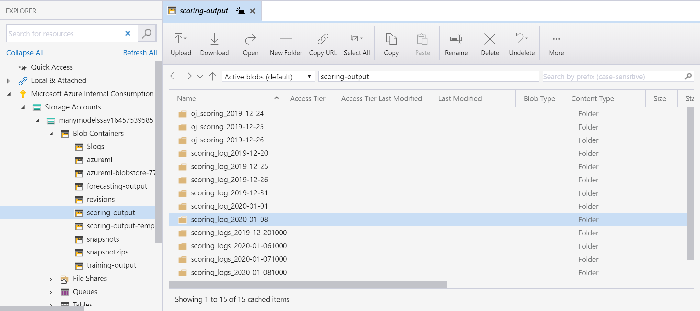
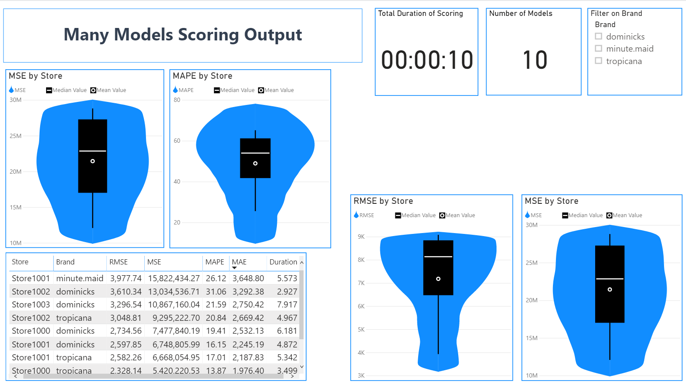
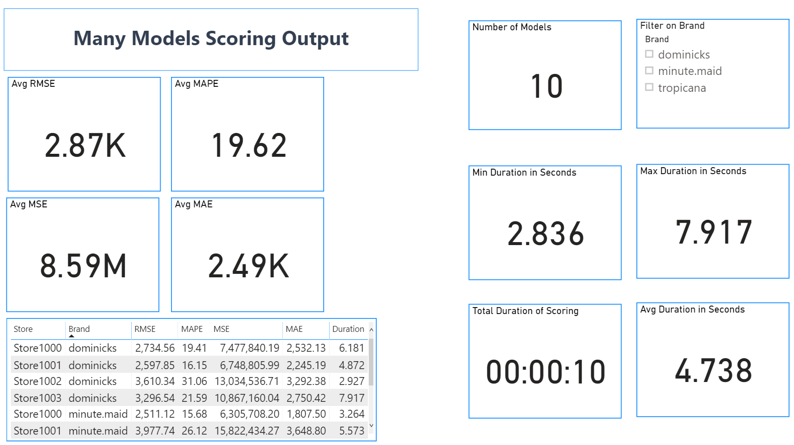

# Scoring Many Models 

## Overview

## Reporting 
Once you have run through the scoring notebook, navigate to Microsoft Storage Explorer. From the Microsoft Storage Explorer navigate to the Azure Storage Container you have designated your scoring logs to. You will want to download the most recent scoring file and save it to your local computer.

 

Now that you have downloaded the scoring log file, open up the Many Models Scoring Power BI file. You will be prompted for the **file path** of the scoring log file located on your computer. Once you have entered the file path, click **Load** to populate the Power BI report. 
 
  

When the scoring log file loads into Power BI, you will see the populated report as seen below: 

 

 
