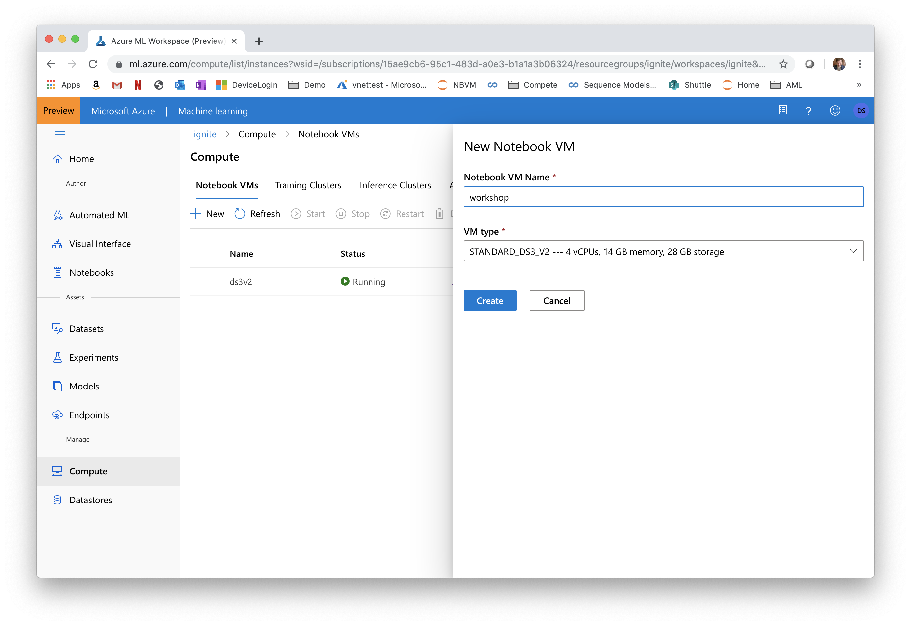
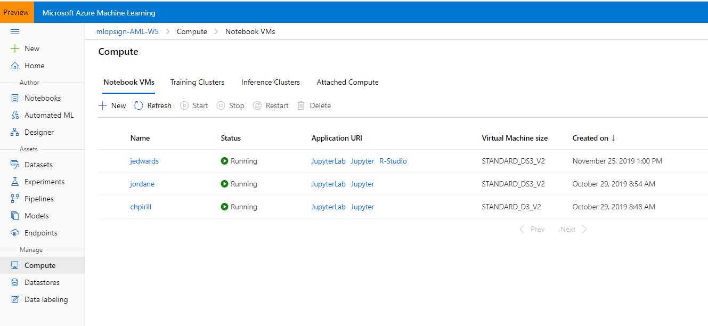

# Environment Setup

## 1.0 Creating an AzureML Notebook VM

To start with, we will create a Notebook VM. The Notebook VM will serve as an interactive workstation in the cloud that serves as a Jupyter server.

1. Open [Azure Machine Learning Studio](https://ml.azure.com/).
2. Navigate to 'Notebook VMs' tab in Compute and click on 'New'.
3. Choose some sufficiently unique name, keep the default VM type (STANDARD_DS3V2 -- a fairly inexpensive machine type costing about $0.27/hour) and click 'Create':


See [here](https://docs.microsoft.com/en-us/azure/machine-learning/service/how-to-configure-environment#notebookvm) for details on creating AzureML Notebook VMs.

**Note that this machine will keep running until you stop it from the portal.**

## 2.0 Clone git Repository to Workspace storage

To clone this git repository onto the workspace, follow the steps below:

1. To get started, first navigate to the JupyterLab instance running on the Notebook VM by clicking on the JupyterLab link shown below:


1. After going through authentication, you will see the JupyterLab frontend. As you authenticate, make sure to use the same user to log in as was used to create the Notebook VM, or else your access will be denied. Next open an Terminal (either by File/New/Terminal, or by just clicking on Terminal in the Launcher Window).


1. In the terminal window clone this repository by typing:
```
        git clone https://github.com/microsoft/solution-accelerator-km-aml.git
```
4. You will be prompted to provide your github username and for your password you will need to provide a personal access token. Please follow the steps here to [create a personal access token.](https://help.github.com/en/github/authenticating-to-github/creating-a-personal-access-token-for-the-command-line) 
