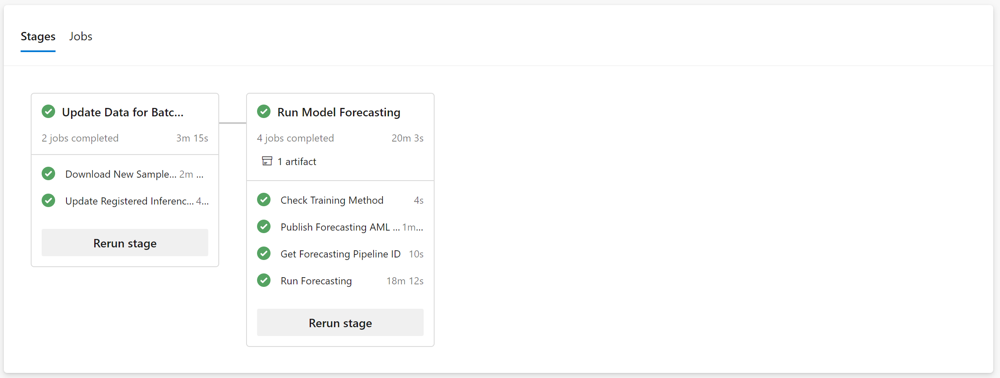

# 3 - Batch Forecasting Pipeline

The batch forecasting pipeline will:

- Update the inference dataset with the latest version of data.
- Launch batch forecasting and create batch predictions for all the models.

## Instructions

Just create the pipeline as you did before in the [setup pipeline](../1-setup/) and [modeling pipeline](../2-modeling/), selecting branch **``v2-preview``** and setting the path to [`/mlops-pipelines/3-batch-forecasting/pipeline-batch-forecasting.yml`](pipeline-batch-forecasting.yml).

Then, run the pipeline and wait for it to finish.

## Result

The pipeline run should look like this:

Containing the following stages and jobs:

- Update Data for Batch Forecasting
  - Download New Sample Files
  - Update Registered Inference Dataset
- Run Model Forecasting
  - Check Training Method
  - Publish Forecasting AML Pipeline
  - Get Forecasting Pipeline ID
  - Run Forecasting

## Details

If you want to learn about the details and ways to customize the batch forecasting pipeline please read the [details page](Details.md).
