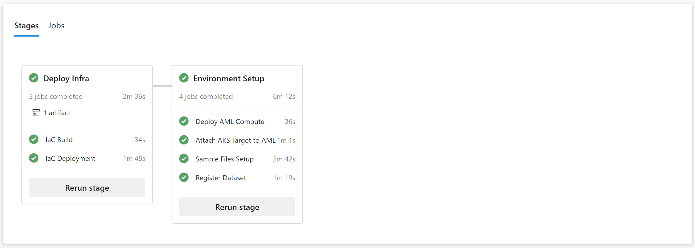
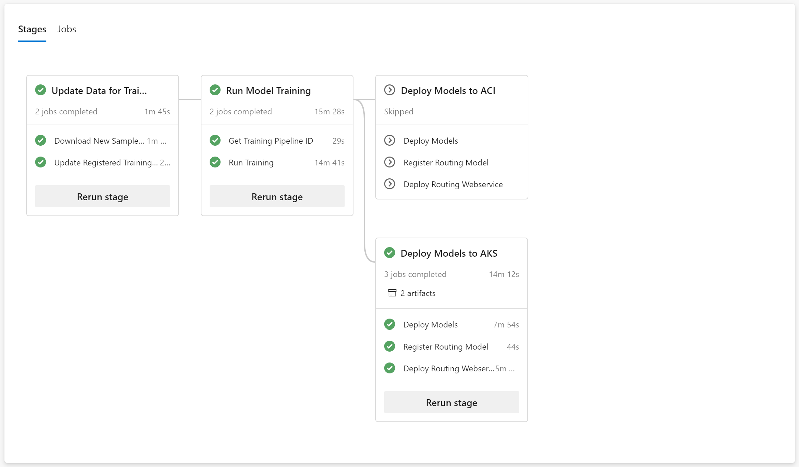
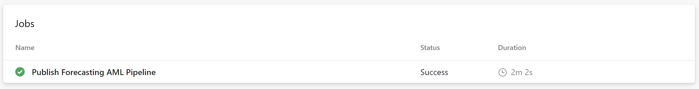
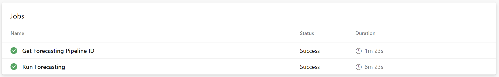

# Instructions

You'll use Azure DevOps for running the MLOps pipelines. Create an [organization](https://docs.microsoft.com/en-us/azure/devops/organizations/accounts/create-organization?view=azure-devops#create-an-organization) an a [project](https://docs.microsoft.com/en-us/azure/devops/organizations/projects/create-project?view=azure-devops&tabs=preview-page#create-a-project) for the Many Models solution.

## 0. Before creating the pipelines

- Create an **Azure Resource Manager** [service connection](https://docs.microsoft.com/en-us/azure/devops/pipelines/library/service-endpoints?view=azure-devops&tabs=yaml#create-a-service-connection) to access the subscription and resource group where you plan to deploy the Many Models solution. The resource group should already be created. Mark the option to grant access permission to all pipelines. Choose any name you want, and copy it as you'll need it in the next step.

- Create a [variable group](https://docs.microsoft.com/en-us/azure/devops/pipelines/library/variable-groups?view=azure-devops&tabs=classic#create-a-variable-group) called **``manymodels-vg``**, with the following variables:

| Variable Name               | Short description |
| --------------------------- | ----------------- |
| DATASET_MAXFILES            | Number of sample files to use (1 file = 1 model) |
| NAMESPACE                   | Unique naming prefix for created resources |
| LOCATION                    | [Azure location](https://azure.microsoft.com/en-us/global-infrastructure/locations/), no spaces |
| RESOURCE_GROUP              | Name of the Azure Resource Group that you'll be using (should be already created) |
| SERVICECONNECTION_GROUP     | Name of the connection you created in the last step |
| TRAINING_METHOD             | "automl" or "customscript" depending which method you want to use for training the models |
| DEPLOY_ACI                  | Whether to deploy in ACI (true/false, default false) |
| DEPLOY_AKS                  | Whether to deploy in AKS (true/false, default false) |
| AKS_NAME                    | [Optional] Name of the AKS resource you'll use for deploying the models |
| AKS_RESOURCE_GROUP          | [Optional] Name of the resource group where the AKS resource is located |

## 1. Setup Pipeline

The setup pipeline will:

- Deploy Azure Machine Learning and the other necessary resources into the resource group you specified.

- Set up the Azure Machine Learning worskpace, creating a compute target and attaching the AKS cluster.

- Download as many files as you specified in the `DATASET_MAXFILES` variable and register them as a dataset in AML.

Create the pipeline as in [here](https://github.com/microsoft/MLOpsPython/blob/master/docs/getting_started.md#create-the-iac-pipeline), selecting branch **``v2-preview``** and setting the path to [/mlops-pipelines/1-setup/pipeline-setup.yml](1-setup/pipeline-setup.yml).

The pipeline run should look like this:

## 2. Training Code Build Pipeline

The training code build pipeline will:

- Create an Azure Machine Learning Pipeline that will train many models in parallel using the `train.py` script in the corresponding [scripts folder](../scripts/).

- Publish the AML Pipeline into the AML workspace so it's ready to use whenever we want to retrain.

Before creating the Azure DevOps pipeline:

- Make sure the [AML extension](https://marketplace.visualstudio.com/items?itemName=ms-air-aiagility.vss-services-azureml) is installed in the Azure DevOps organization.

- Create an **Azure Resource Manager** [service connection](https://docs.microsoft.com/en-us/azure/devops/pipelines/library/service-endpoints?view=azure-devops&tabs=yaml#create-a-service-connection) to access the Machine Learning Workspace you created in the setup pipeline before. As you did before, mark the option to grant access permission to all pipelines, and copy the name as you'll need it in the next step.

- Modify the **``manymodels-vg``** variable group you created before, and add this new variable:

| Variable Name               | Short description |
| --------------------------- | ----------------- |
| SERVICECONNECTION_WORKSPACE | Name of the connection to the AML Workspace you have just created |

Then, create the pipeline as you did before, selecting branch **``v2-preview``** and setting the path to [/mlops-pipelines/2-training-code-build/pipeline-training-code-build.yml](2-training-code-build/pipeline-training-code-build.yml).

The pipeline run should look like this:

## 3. Modeling Pipeline

The modeling pipeline will:

- Update the training dataset with the latest version of data.

- Trigger the many models training by invoking the training AML Pipeline previously published.

- Group the registered models according to specified tags and maximum container size (500 by default).

- Deploy each group into a different webservice hosted in ACI and/or AKS. These webservices will all use the same `model_webservice.py` script in the corresponding [scripts folder](../scripts/).

- Deploy the entry point that will route the requests to the corresponding model webservice. This webservice will use the `routing_webservice.py` script in the corresponding [scripts folder](../scripts/).

Create the pipeline as you did before, selecting branch **``v2-preview``** and setting the path to [/mlops-pipelines/3-modeling/pipeline-modeling.yml](3-modeling/pipeline-modeling.yml).

The pipeline run should look like this:

The deployment stages will be triggered if you have the corresponding variables `DEPLOY_ACI`/`DEPLOY_AKS` in the variable group set to `true`.

There are two variables you can add to the **``manymodels-vg``** variable group to customize deployments:

| Variable Name               | Short description |
| --------------------------- | ----------------- |
| MAX_CONTAINER_SIZE | Maximum number of models to fit into one webservice container |
| RESET_DEPLOYMENT   | Set to `true` to reset existing containers |
| UPDATE_DEPLOYMENT  | Set to `true` to update all existing webservices (for config changes to apply) |

## 4. [Optional] Batch Forecasting Code Build Pipeline

The batch forecasting code build pipeline will:

- Create an Azure Machine Learning Pipeline that will generate batch forecasts for all the models in parallel using the `forecast.py` script in the corresponding [scripts folder](../scripts/).

- Publish the AML Pipeline into the AML workspace so it's ready to use whenever we want to do batch forecasting.

You only need to create this Azure DevOps pipeline if you want to do batch forecasting. Do it as you did before, selecting branch **``v2-preview``** and setting the path to [/mlops-pipelines/4-batch-forecasting-code-build/pipeline-batch-forecasting-code-build.yml](4-batch-forecasting-code-build/pipeline-batch-forecasting-code-build.yml).

The pipeline run should look like this:

## 5. [Optional] Batch Forecasting Pipeline

The batch forecasting pipeline will:

- Update the inference dataset with the latest version of data.

- Trigger the many models batch forecasting by invoking the batch forecasting AML Pipeline published in step 4.

Create the pipeline as you did before, selecting branch **``v2-preview``** and setting the path to  [/mlops-pipelines/5-batch-forecasting/pipeline-batch-forecasting.yml](5-batch-forecasting/pipeline-batch-forecasting.yml).

The pipeline run should look like this:

