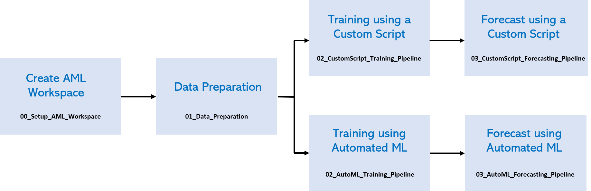

# Many Models Notebooks

This folder contains the notebooks for running the Many Models Solution Accelerator. The functionality is broken into different notebooks designed to be run sequentially.

## Setup

### 1. Deploy Resources

Start by deploying the resources to Azure. The button below will deploy Azure Machine Learning and its related resources:

### 2. Configure Development Environment

Next you'll need to configure your [development environment](https://docs.microsoft.com/azure/machine-learning/how-to-configure-environment) for Azure Machine Learning. We recommend using a [Notebook VM](https://docs.microsoft.com/azure/machine-learning/how-to-configure-environment#compute-instance) as it's the fastest way to get up and running. Follow the steps in [EnvironmentSetup.md](./EnvironmentSetup.md) to create a Notebook VM and clone the repo onto it.

## Running the notebooks

Once your development environment is set up, run through the Jupyter Notebooks sequentially following the steps outlined. By the end, you'll know how to train, score, and make predictions using the many models pattern on Azure Machine Learning.

There are two ways to train many models:

1. Using a custom training script
2. Using Automated ML

However, the steps needed to set the workspace up and prepare the datasets are the same no matter which option you choose.

### Before training the models

| Notebook       | Description                                |
|----------------|--------------------------------------------|
| [`00_Setup_AML_Workspace.ipynb`](00_Setup_AML_Workspace.ipynb) | Creates and configures the AML Workspace, including deploying a compute cluster for training. |
| [`01_Data_Preparation.ipynb`](01_Data_Preparation.ipynb) | Prepares the datasets that will be used during training and forecasting. |

### Using a custom training script to train the models:

The following notebooks are located under the [`Custom_Script/`](Custom_Script/) folder.

| Notebook       | Description                                |
|----------------|--------------------------------------------|
| [`02_CustomScript_Training_Pipeline.ipynb`](Custom_Script/02_CustomScript_Training_Pipeline.ipynb) | Creates a pipeline to train a model for each store and orange juice brand in the dataset using a custom script. |
| [`03_CustomScript_Forecasting_Pipeline.ipynb`](Custom_Script/03_CustomScript_Forecasting_Pipeline.ipynb) | Creates a pipeline to forecast future orange juice sales using the models trained in the previous step. |
| [`03_CustomScript_Realtime_Forecasting_Deployment.ipynb`](Custom_Script/03_CustomScript_Realtime_Forecasting_Deployment.ipynb) | Deploys the models into webservices to do real-time forecasting of future orange juice sales upon request. |

### Using Automated ML to train the models:

The following notebooks are located under the [`Automated_ML/`](Automated_ML/) folder.

| Notebook       | Description                                |
|----------------|--------------------------------------------|
| [`02_AutoML_Training_Pipeline.ipynb`](Automated_ML/02_AutoML_Training_Pipeline/02_AutoML_Training_Pipeline.ipynb) | Creates a pipeline to train a model for each store and orange juice brand in the dataset using Automated ML. |
| [`03_AutoML_Forecasting_Pipeline.ipynb`](Automated_ML/03_AutoML_Forecasting_Pipeline/03_AutoML_Forecasting_Pipeline.ipynb) | Creates a pipeline to forecast future orange juice sales using the models trained in the previous step. |
| [`03_CustomScript_Realtime_Forecasting_Deployment.ipynb`](Custom_Script/03_AutoML_Forecasting_Pipeline/03_CustomScript_Realtime_Forecasting_Deployment.ipynb) | Deploys the models into webservices to do real-time forecasting of future orange juice sales upon request. |
